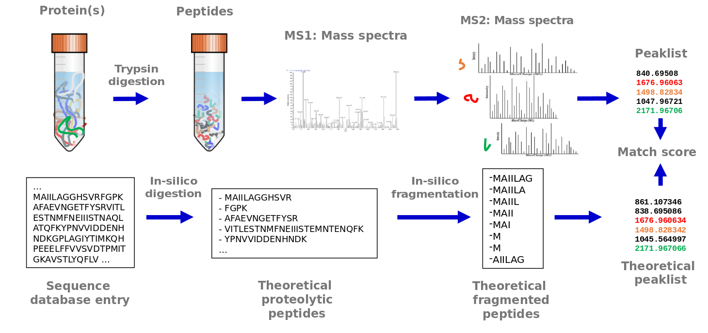

:::::::::::::::::::::::::::::::::::::: questions 

- How can I process my output files from a mass spectrometry-based proteomics experiment? 

::::::::::::::::::::::::::::::::::::::::::::::::

::::::::::::::::::::::::::::::::::::: objectives

- Learn how to process proteomics data using DIA-NN

::::::::::::::::::::::::::::::::::::::::::::::::

## Processing proteomics data

There are many software options for processing mass spectrometry-based proteomics output. These software *match mass spectra* against an empirical or predicted spectral library to *identify peptides* and infer the protein to which they belong.

Some software you may have heard of include Spectronaut, Fragpipe, MaxQuant and DIA-NN. Each software have slightly different functionality and attributes, and are frequently updated. In this tutorial, we are demonstrating the use of **DIA-NN**, a software designed to process **DIA** proteomics data.

](episodes/fig/02diann_peptideMatching.png)

### Why DIA-NN?

Key features of DIA-NN software include:

- **Neural network–based scoring:** Improves identification confidence.
- **Interference correction:** Enhances quantification accuracy.
- **Library-free analysis:** Can work without a spectral library (generating one directly from DIA data).
- **High speed and efficiency:** Suitable for large-scale datasets.
- **Cross-run normalization:** Ensures consistent quantification across experiments.
- **Command-line executable:** DIA-NN can be run from a graphical user interface (GUI) or directly from the command line, making it easy to integrate into an automated pipeline.

DIA-NN is free to download. Detailed operating instructions and a link to install the latest version of DIA-NN can be found on the [GitHub page](https://github.com/vdemichev/DiaNN?tab=readme-ov-file).

:::callout
# Important Note

Due to the amount of time it will take to process the data, you do not need to install or operate DIA-NN for the purposes of this tutorial. Pre-processed data is provided, which has been prepared following the procedures described below.
:::

## DIA-NN workflow

## Part 1: Creating a spectral library

DIA-NN analysis consists of two steps. The first step is to generate a predicted spectral library for your experimental organism.

1. 

Variable mods




``` bash
C:\DIA-NN\2.2.0\diann.exe `
--lib "" `
--out "C:\path\to\output\report.parquet" ` # Replace with file path
--out-lib "C:\path\to\output\report-lib.parquet" ` # Replace with file path
--fasta "C:\path\to\UniprotFasta\.fasta" ` # Replace with file path
--fasta "C:\path\to\ContaminantsFasta\.fasta" ` # Replace with file path
--threads 30 ` # Replace with the number of threads to use for this analysis
--verbose 1 `
--qvalue 0.01 `
--matrices  `
--gen-spec-lib `
--predictor `
--reannotate `
--fasta-search `
--min-fr-mz 200 `
--max-fr-mz 1800 `
--met-excision `
--min-pep-len 7 `
--max-pep-len 30 `
--min-pr-mz 300 `
--max-pr-mz 1800 `
--min-pr-charge 1 `
--max-pr-charge 4 `
--cut K*,R* `
--missed-cleavages 1 `
--unimod4 `
--rt-profiling 
```


This library can be re-used for all of analyses of samples from the same organism. It is recommended to re-download the UniProt fasta and re-run this step approximately once a month to ensure your library is up-to-date.


## General Workflow

The DIA-NN workflow typically consists of the following steps:

1. **Prepare input data**
   - Raw DIA data files (`.raw`, `.wiff`, or converted `.mzML` files).
   - (Optional) A spectral library (`.tsv` or `.speclib`).

2. **Run DIA-NN**
   - Can be run via the **graphical user interface (GUI)** or **command line**.
   - Specify inputs, output directory, and parameters (e.g., FDR cutoff, protein grouping, library mode).

3. **Output files**
   - Quantification tables for proteins and peptides (`report.tsv` or `.parquet`).
   - Run summaries and performance metrics.
   - Optional normalized intensity data for downstream statistical analysis.

4. **Post-processing**
   - Further analysis can be done in R (e.g., `tidyverse`, `MSstats`, `limma`), Python, or visualization tools.
   - Data can also be imported into platforms like **Perseus**, **Spectronaut**, or **Skyline** for downstream exploration.


## Example Command-Line Usage

Below is an example of running DIA-NN in command-line mode (adjust paths for your setup):

```bash
DIA-NN.exe --f "path/to/mzML_files/" \
           --out "path/to/output_folder/" \
           --lib "path/to/library.tsv" \
           --threads 8 \
           --fasta "path/to/fasta_file.fasta" \
           --qvalue 0.01 \
           --verbose 1
```

This command tells DIA-NN to:

Analyze all .mzML files in a folder

Use a specified spectral library and FASTA file

Run on 8 threads

Output results with a 1% false discovery rate cutoff


:::spoiler
# More about DIANN

- For more background information, see the original publication:  
*Demichev, V., et al. (2020). DIA-NN: neural networks and interference correction enable deep proteome coverage in high throughput. Nature Methods.*  [https://doi.org/10.1038/s41592-019-0638-x](https://doi.org/10.1038/s41592-019-0638-x)

- For further details about the different DIA-NN settings, see the [GitHub page] (https://github.com/vdemichev/DiaNN?tab=readme-ov-file)

- If you come across any issues, the creators are fairly active at responding to [issues](https://github.com/vdemichev/DiaNN/issues) and [discussions](https://github.com/vdemichev/DiaNN/discussions) on their GitHub

:::

::::::::::::::::::::::::::::::::::::: keypoints 

- DIANN is fun and is theoretically easy to use!

::::::::::::::::::::::::::::::::::::::::::::::::


