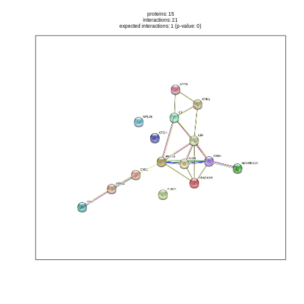
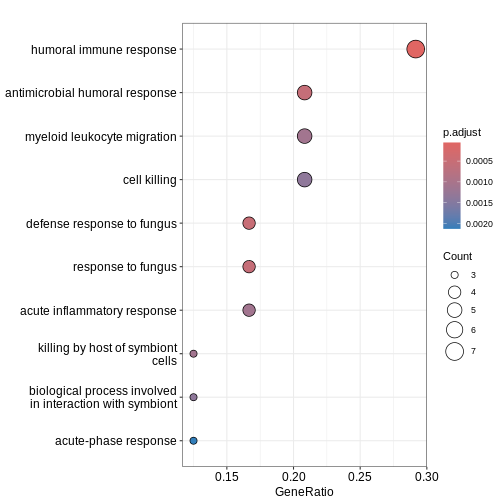
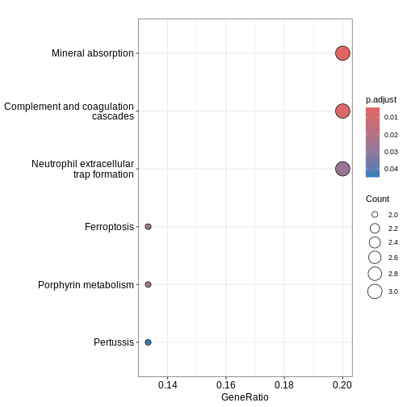

:::::::::::::::::::::::::::::::::::::: questions 

- How can DE results be used to identify biologically meaningful patterns?  
- How can we visualise and interpret protein–protein interaction (PPI) networks and pathway enrichment results?

::::::::::::::::::::::::::::::::::::::::::::::::

::::::::::::::::::::::::::::::::::::: objectives

- To visualise significant proteins using network analysis (STRING)  
- To identify enriched biological processes and pathways (GO and KEGG)  

::::::::::::::::::::::::::::::::::::::::::::::::


## Network and Enrichment Analysis

Now that we have a list of differentially expressed proteins, we can explore how these proteins interact with each other and what biological functions or pathways they are involved in.

This step helps translate statistical significance into biological meaning by integrating our results with known protein–protein interactions (PPI) and functional annotation databases.

### STRING Protein–Protein Interaction Network

The STRING database integrates known and predicted protein–protein interactions from multiple sources (e.g., experimental data, text mining, co-expression, and curated databases).

We can visualise DE proteins within the context of their interaction network to identify clusters or modules potentially corresponding to biological pathways.


``` r
string_db <- STRINGdb$new(version = "11.5", species = 9606, score_threshold = 400)
mapped <- string_db$map(results, "Protein.Names", removeUnmappedRows = TRUE)
de_proteins_mapped <- mapped %>% filter(adj.P.Val < 0.05)

# Plot network of significant proteins
string_db$plot_network(de_proteins_mapped$STRING_id)
```


Note if not working, use this:


``` r
load("data/string_db.RData")

de_proteins_mapped <- mapped %>% filter(adj.P.Val < 0.05)

hits <- de_proteins_mapped$STRING_id

# Plot network of significant proteins
string_db$plot_network(hits)
```



You can inspect available functions within the STRINGdb package by running:


``` r
STRINGdb$methods()
```

``` output
 [1] ".objectPackage"                      ".objectParent"                      
 [3] "add_diff_exp_color"                  "add_proteins_description"           
 [5] "benchmark_ppi"                       "benchmark_ppi_pathway_view"         
 [7] "callSuper"                           "copy"                               
 [9] "enrichment_heatmap"                  "export"                             
[11] "field"                               "get_aliases"                        
[13] "get_annotations"                     "get_bioc_graph"                     
[15] "get_clusters"                        "get_enrichment"                     
[17] "get_graph"                           "get_homologs"                       
[19] "get_homologs_besthits"               "get_homology_graph"                 
[21] "get_interactions"                    "get_link"                           
[23] "get_neighbors"                       "get_paralogs"                       
[25] "get_pathways_benchmarking_blackList" "get_png"                            
[27] "get_ppi_enrichment"                  "get_ppi_enrichment_full"            
[29] "get_proteins"                        "get_pubmed"                         
[31] "get_pubmed_interaction"              "get_subnetwork"                     
[33] "get_summary"                         "get_term_proteins"                  
[35] "getClass"                            "getRefClass"                        
[37] "import"                              "initFields"                         
[39] "initialize"                          "load"                               
[41] "load_all"                            "map"                                
[43] "mp"                                  "plot_network"                       
[45] "plot_ppi_enrichment"                 "post_payload"                       
[47] "ppi_enrichment"                      "remove_homologous_interactions"     
[49] "set_background"                      "show"                               
[51] "show#envRefClass"                    "trace"                              
[53] "untrace"                             "usingMethods"                       
```


### Functional Enrichment (GO and KEGG)

Using the identified significant DE proteins, we can perform functional enrichment analysis to determine whether certain biological processes (BP), cellular components (CC), or molecular functions (MF) are over-represented.

Two common types of enrichment are:

- Gene Ontology (GO): describes BPs, CCs, amd MFs
- KEGG pathways: provides curated biochemical pathways


``` r
#Subset genes from results table
de_proteins <- results %>% filter(adj.P.Val < 0.05)

# Convert UniProt IDs to Entrez IDs for enrichment analysis
converted <- bitr(de_proteins$Protein.Group,
                  fromType = "UNIPROT",
                  toType = "ENTREZID",
                  OrgDb = org.Hs.eg.db)
```

``` output
'select()' returned 1:1 mapping between keys and columns
```

``` warning
Warning in bitr(de_proteins$Protein.Group, fromType = "UNIPROT", toType =
"ENTREZID", : 7.69% of input gene IDs are fail to map...
```

``` r
# GO Biological Process enrichment
ego <- enrichGO(gene = converted$ENTREZID,
                OrgDb = org.Hs.eg.db,
                ont = "BP",
                pAdjustMethod = "BH",
                pvalueCutoff = 0.05,
                readable = TRUE)

dotplot(ego, showCategory = 10)
```



``` r
# KEGG pathway enrichment
ekegg <- enrichKEGG(gene = converted$ENTREZID,
                    organism = 'hsa',
                    pvalueCutoff = 0.05)
```

``` output
Reading KEGG annotation online: "https://rest.kegg.jp/link/hsa/pathway"...
```

``` output
Reading KEGG annotation online: "https://rest.kegg.jp/list/pathway/hsa"...
```

``` r
dotplot(ekegg, showCategory = 10)
```



:::challenge

How does this figure compare to [Figure 4](https://mdpi-res.com/biomedicines/biomedicines-12-00333/article_deploy/html/images/biomedicines-12-00333-g004.png) in the original paper?

:::solution

While there are many immune-related pathways in both, the exact pathways are not identical. This is likely due to the fact we are using a subset of the larger dataset.


:::
:::::


::::::::::::::::::::::::::::::::::::: keypoints 

- DE analysis identifies statistically significant changes in protein abundance between conditions.
- Network analysis (STRING) reveals potential physical or functional interactions among DE proteins.
- Enrichment analysis (GO/KEGG) links those proteins to known biological processes or pathways.
- Using multiple approaches can help you interpret proteomics data in a systems biology context.

::::::::::::::::::::::::::::::::::::::::::::::::

